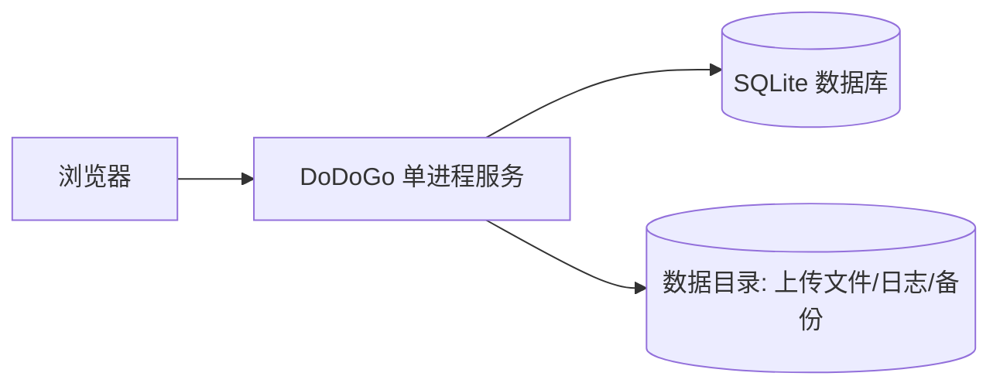
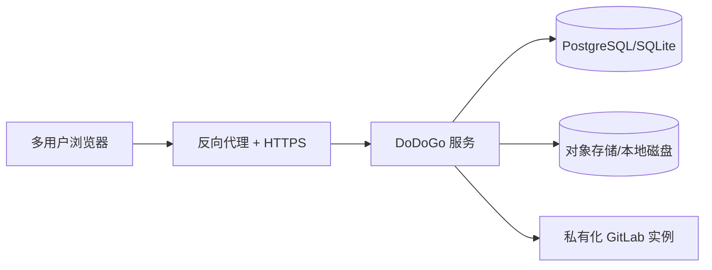
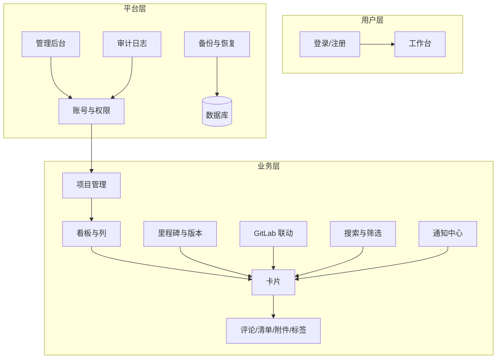
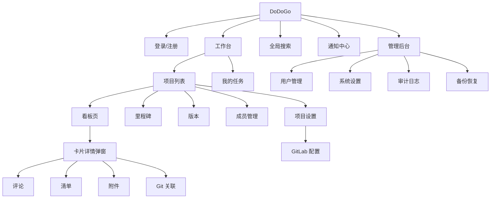
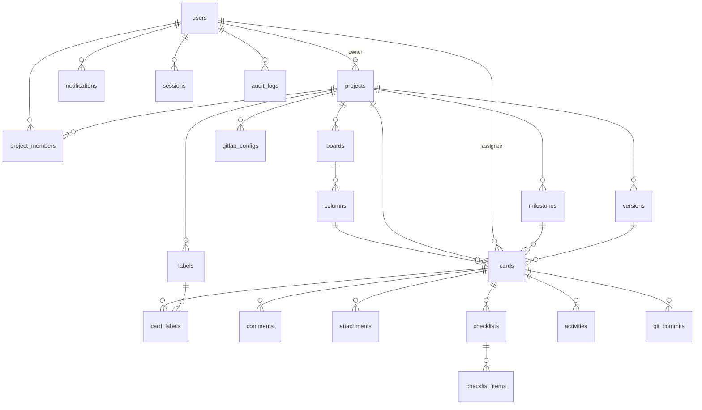

# DoDoGo 软件设计文档

| 项目名称 | DoDoGo |
| --- | --- |
| 文档版本 | v1.0 |
| 文档状态 | 评审稿 |
| 编写日期 | 2026-08-18 |
| 适用范围 | 研发、测试、运维、产品评审 |

## 修订记录

| 版本 | 日期 | 修订人 | 说明 |
| --- | --- | --- | --- |
| v1.0 | 2026-08-18 | DoDoGo 团队 | 依据《dodogo初步设计稿.md》完成首版详细设计 |

---

# 1. 引言

## 1.1 文档目的

本文档是 DoDoGo 项目的详细软件设计文档，用于：

1. 完整承接并细化《dodogo初步设计稿.md》中的 8 项核心需求；
2. 补充项目管理软件中常见但设计稿未提及的功能，形成完整的 v1.0 功能范围；
3. 明确用户角色、权限模型、数据模型、接口约定与界面交互规范；
4. 作为技术设计文档与开发实施方案的输入依据，并作为后续验收的标准。

## 1.2 项目背景

DoDoGo 是一款使用 Rust 语言开发的、类 Trello 的轻量项目管理软件。它默认以本地单机方式运行，数据完全由用户掌握，也可以部署在自有服务器上供团队协作使用。产品面向个人开发者与小规模团队，强调"轻量、快速、简单、数据可控"。

## 1.3 术语与缩写

| 术语 | 说明 |
| --- | --- |
| 项目（Project） | 一个独立的工作空间，包含看板、里程碑、版本、成员等，如"网站重构" |
| 看板（Board） | 项目内的核心管理视图，由若干列组成，如"需求 / 开发 / 测试 / 发布" |
| 列（Column） | 看板中的横向分区，表示工作阶段或状态，可自定义名称与顺序 |
| 卡片（Card） | 看板中的最小任务单元，承载标题、描述、指派、标签等所有任务信息 |
| 任务单号（Task Number） | 卡片在项目内的唯一编号，形如 `DODG-12`，用于私有化 GitLab 提交关联 |
| 私有化 GitLab（Self-hosted GitLab） | 部署在本地网络或自有服务器上的 GitLab CE/EE 实例；本文档"GitLab 联动"功能的唯一目标平台 |
| 里程碑（Milestone） | 项目内的重要时间节点或目标，可关联卡片并自动统计进度 |
| 版本（Release） | 项目的发布版本，如 v1.0.0，可关联卡片并记录发布状态 |
| 完成列（Done Column） | 被标记为"完成"语义的列，用于统计卡片完成状态 |
| RBAC | 基于角色的访问控制（Role-Based Access Control） |
| WIP | 进行中工作限制（Work In Progress），限制单列同时进行的卡片数 |
| MR | GitLab 合并请求（私有化 GitLab 概念）；GitHub 的 Pull Request 概念类似，列入后续支持计划 |
| SSE | Server-Sent Events，服务端单向实时推送 |
| Webhook | GitLab 主动向 DoDoGo 推送事件的回调机制 |

## 1.4 参考文档

| 文档 | 说明 |
| --- | --- |
| dodogo初步设计稿.md | 需求来源 |
| 02-技术设计文档.md | 技术实现依据 |
| 03-开发实施方案.md | 开发排期与验收依据 |

---

# 2. 产品定位与目标

## 2.1 产品定位

DoDoGo 是一款**本地优先（Local-First）**、可私有化部署的轻量项目管理软件，以"看板 + 卡片"为核心工作方式，同时覆盖里程碑、版本、私有化 GitLab 联动等常见项目管理场景。

## 2.2 目标用户

- 个人开发者：单人管理个人项目，追求零安装成本、极低资源占用；
- 小团队（2-20 人）：需要多账号协作、看板管理与 Git 提交关联；
- 注重数据隐私的企业/团队：不希望任务数据上传到第三方 SaaS。

## 2.3 设计原则

| 原则 | 描述 |
| --- | --- |
| 本地优先 | 默认单机部署，数据存放于用户自有目录，无强制外部依赖 |
| 轻量高效 | 单进程、单数据库、秒级启动，内存占用控制在百 MB 内 |
| 简单直观 | 扁平化 UI、拖拽式操作、最小学习成本 |
| 数据可控 | 提供备份、恢复、导出能力，用户始终拥有数据 |
| 可扩展 | 模块化设计，看板、GitLab、通知等均可独立演进 |

## 2.4 需求范围界定

### v1.0 包含

1. Windows / Linux 部署（v1.0 优先 Windows，Linux 同步保证可运行）；
2. 多账号登录、角色权限、管理员后台；
3. 多项目管理，核心看板功能，列可自定义；
4. 卡片式任务，可视化编辑与拖拽；
5. 卡片支持图片、链接与 Markdown 富文本；
6. 简约扁平色块设计语言；
7. 里程碑、版本等常见项目管理功能；
8. 与私有化部署的 GitLab 联动，按任务单号自动关联提交记录；
9. 补充常用功能：评论、清单、标签、附件、活动历史、搜索筛选、通知、导出、快捷键等；
10. Markdown 所见即所得（WYSIWYG）编辑（编辑 / 所见即所得 / 预览三模式）；
11. 看板列改名、颜色标记（背景色而非小图标）与列拖拽排序；
12. 卡片封面图预览、卡片面同步显示里程碑/版本徽标；里程碑/版本详情页（含关联卡片清单）；
13. 项目自定义图标（上传图片 / 颜色+指定文字两种模式）；
14. 桌面客户端壳（wry + WebView2，自动拉起服务并打开窗口，与网页版同源）。

### v1.0 明确不包含（未来版本）

| 排除项 | 说明 |
| --- | --- |
| 甘特图 / 日历视图 | 规划为二期 |
| 即时聊天 | 依赖第三方 IM 或二期规划 |
| 移动端原生 App | v1.0 仅保证浏览器响应式可用的降级体验 |
| GitLab.com / GitHub.com 等公有云与第三方 Git 平台联动 | 列入二期及后续版本计划（v1.0 仅支持私有化部署的 GitLab，不支持 GitLab.com / GitHub.com） |
| 插件市场 / 开放 API 平台 | 二期规划 |

---

# 3. 总体设计

## 3.1 部署形态

### 形态 A：单机模式（默认，v1.0 重点）



- 一个二进制、一个数据库文件、一个数据目录；
- Windows 以 exe + 服务方式（NSSM）运行，Linux 以 systemd 运行；
- 适合个人与局域网小团队。

### 形态 B：服务器模式（v1.0 同步支持）



- 数据库可切换 PostgreSQL，支持更高并发；
- 通过 Nginx / Caddy 提供 HTTPS 与静态资源缓存。

## 3.2 功能模块总览



## 3.3 用户角色与权限模型

### 3.3.1 账号与系统级角色

账号状态：`正常`、`禁用`、`待激活`。

| 系统角色 | 说明 |
| --- | --- |
| 系统管理员（admin） | 拥有系统全部权限：用户管理、系统设置、审计查看、数据备份、所有项目数据 |
| 普通用户（user） | 可创建项目、加入项目，仅能访问自己被授权的数据 |

首次启动时，系统引导创建第一个管理员账号；其余用户由注册（可开关）或管理员创建。

### 3.3.2 项目级角色

| 项目角色 | 说明 |
| --- | --- |
| 所有者（Owner） | 项目创建者，拥有全部项目权限（含删除、转让） |
| 管理员（Admin） | 可管理成员、看板结构、项目设置，但不可删除/转让项目 |
| 成员（Member） | 可创建与编辑卡片、评论、上传附件、移动卡片 |
| 访客（Viewer） | 只读访问，可查看与评论（可选），不可修改 |

### 3.3.3 权限矩阵

✓ = 允许；— = 不允许；◇ = 需额外配置

| 操作 | Owner | Admin | Member | Viewer |
| --- | --- | --- | --- | --- |
| 查看项目 / 看板 | ✓ | ✓ | ✓ | ✓ |
| 创建 / 编辑 / 移动卡片 | ✓ | ✓ | ✓ | — |
| 删除 / 归档卡片 | ✓ | ✓ | 本人创建的 ✓ | — |
| 评论、@提及、上传附件 | ✓ | ✓ | ✓ | 仅评论◇ |
| 管理列（增删改排序、WIP） | ✓ | ✓ | — | — |
| 管理看板（新建、复制、归档） | ✓ | ✓ | — | — |
| 管理项目成员 | ✓ | ✓ | — | — |
| 项目设置 / 转让 | ✓ | 部分◇ | — | — |
| 删除项目 | ✓ | — | — | — |
| 里程碑 / 版本管理 | ✓ | ✓ | — | — |
| GitLab 配置与同步 | ✓ | ✓ | 手动同步◇ | — |
| 导出数据 | ✓ | ✓ | 自己可访问范围◇ | 自己可访问范围◇ |

### 3.3.4 权限判定顺序

1. 未登录且项目为私有 → 拒绝；
2. 系统管理员 → 放行；
3. 项目角色判断 → 按权限矩阵放行或拒绝；
4. 数据级权限（如删除"本人创建的卡片"）→ 在业务层二次校验。

## 3.4 数据可见性

- 默认所有项目私有，仅项目成员可见；
- 未登录用户仅可访问"公开项目"（二期开放，v1.0 不提供）；
- 卡片级可见性跟随项目；项目删除后其下所有数据一并删除（经回收站/确认流程）。

---

# 4. 功能需求详述

## 4.1 账号与认证

### 4.1.1 注册

- 注册开关由系统设置控制（默认开启，本地单机部署建议开启"邀请注册"）；
- 注册字段：用户名（3-32 字符，字母/数字/下划线/中文）、邮箱（可选，格式校验）、密码（8-64 字符，至少包含字母与数字）；
- 用户名与邮箱全局唯一；
- 密码使用 Argon2id 哈希存储，明文一律不落库。

### 4.1.2 登录与会话

- 支持"用户名 + 密码"或"邮箱 + 密码"登录；
- 登录成功后创建服务端会话，Cookie `HttpOnly + SameSite=Lax`；
- "记住我"有效期 30 天，否则 12 小时（可配置）；
- 同一账号支持多设备会话，可在"账号安全"中列出并吊销会话；
- 登录失败限速：同一账号 15 分钟内失败 5 次则临时锁定 15 分钟（可配置）；
- 登出后会话立即失效。

### 4.1.3 个人资料

- 修改昵称、邮箱、头像（上传图片或使用首字母默认头像）；
- 修改密码需验证旧密码；
- 账号被管理员禁用后，已有会话立即失效，登录被拒绝。

### 4.1.4 找回密码

- 本地模式（未配置 SMTP）：由管理员在后台"重置密码"；
- 服务器模式（已配置 SMTP）：支持邮件发送重置链接（有效期 30 分钟，一次性）。

### 4.1.5 首次启动引导

- 首次启动进入"初始化向导"：创建管理员账号、设置站点名称、选择数据目录（默认）、可选导入示例看板。

## 4.2 工作台与项目管理

### 4.2.1 工作台（首页）

- 我的项目：展示我参与的项目卡片（图标、名称、进度概览），支持排序与搜索；
- 最近访问：按最后访问时间排列；
- 我的任务：汇总"指派给我的、未完成"的卡片，按截止日期排序，点击直达看板；
- 通知摘要：最近未读通知数量。

### 4.2.2 项目创建

创建字段：

| 字段 | 必填 | 规则 |
| --- | --- | --- |
| 项目名称 | 是 | 1-60 字符 |
| 项目 Key | 是 | 2-6 位大写字母/数字，全局唯一，创建后不可修改 |
| 项目描述 | 否 | 500 字符内 |
| 图标 | 否 | 内置 16 色块中选择 |
| 默认看板模板 | 否 | 空看板 / 需求-开发-测试-发布 / 待办-进行中-已完成 |

> 项目 Key 决定卡片单号前缀（如 `DODG-12`），因此创建后不可修改。

### 4.2.3 项目成员管理

- 添加成员：通过用户名或邮箱精确匹配，选择角色后加入；
- 批量操作：一次添加多人、批量修改角色；
- 移除成员：二次确认；被移除成员的卡片指派自动清空，评论保留；
- 邀请链接（可选，v1.0 提供基础版）：生成带过期时间的邀请链接，接受后按预设角色加入。

### 4.2.4 项目归档与删除

- 归档项目：归档后项目只读，不出现在工作台默认列表，可恢复；
- 删除项目：需要二次确认并输入项目 Key 校验；删除后进入 30 天回收站，可恢复或彻底删除；
- 回收站由系统管理员可见与管理（本地单机场景即本机管理员）。

## 4.3 看板与列

### 4.3.1 看板

- 一个项目可创建多个看板（如"开发看板""测试看板"）；
- 看板属性：名称、描述、颜色标记、排序；
- 看板操作：新建、复制（复制列与卡片标题，不含附件）、归档、恢复、删除；
- 默认看板：项目创建时按模板自动生成。

### 4.3.2 列

- 列属性：名称（1-30 字符）、位置、颜色（可选，扁平色块）、WIP 上限（0 表示不限）、是否"完成列"；
- 列操作：新增、重命名、改色、排序（拖拽）、归档、删除（删除前列内卡片需先转移或确认）；
- 完成列：标记后，进入该列的卡片视为完成，参与里程碑/版本进度统计；
- WIP 上限：超过时列头显示超限警告（红色数字），不强制阻止移动（可配置为阻止）；
- 列折叠：支持折叠非当前关注的列（前端交互）。

### 4.3.3 拖拽规则

- 卡片可拖到同列其他位置或跨列；
- 列可拖拽排序；
- 拖拽后立即落库（乐观更新，失败回滚并提示）；
- 多人同时操作时，以服务端时间戳最新者为准并广播刷新（见 6.3 并发控制）；
- 触屏拖拽为二期能力，v1.0 桌面浏览器优先。

## 4.4 卡片

### 4.4.1 卡片字段

| 字段 | 必填 | 说明 |
| --- | --- | --- |
| 标题 | 是 | 1-200 字符，行内可编辑 |
| 描述 | 否 | Markdown 富文本 |
| 任务单号 | 自动 | 项目 Key + 序号，如 `DODG-12`，只读 |
| 所属列 | 自动 | 创建时所在列 |
| 指派人 | 否 | v1.0 单指派人，二期多指派人 |
| 标签 | 否 | 0-N 个，来自项目标签库 |
| 优先级 | 否 | P0 紧急 / P1 高 / P2 中 / P3 低 |
| 开始日期 / 截止日期 | 否 | 日期级；截止日期临近变红提醒 |
| 预估工时 | 否 | 小时数，用于统计 |
| 里程碑 / 版本 | 否 | 各最多关联一个 |
| 清单 | 否 | 多个清单，每个含若干条目 |
| 附件 / 图片 | 否 | 上传文件与图片 |
| 评论 | 否 | Markdown，@提及 |
| 活动历史 | 自动 | 操作审计时间线 |

### 4.4.2 卡片操作

- 创建：点击列尾"+ 添加卡片"，支持回车快速连续创建；默认插入列尾（可配置列首）；
- 编辑：点击标题行内编辑；点击卡片打开详情弹窗；
- 移动：拖拽，或右键/菜单"移动到…"（按列选择）；
- 复制：复制标题与描述（附件、评论不复制），生成新单号，默认插入原卡片之后；
- 归档：移入归档区，可恢复；
- 删除：二次确认；删除后卡片活动记录同步删除（回收站 v1.0 支持卡片级恢复）；
- 订阅：订阅后卡片任何变更推送通知；
- 复制链接：复制 `#DODG-12` 或完整 URL。

### 4.4.3 卡片编号规则

- 单号 = `{项目Key}-{项目内递增序号}`，如 `DODG-12`；
- 序号由项目级计数器生成，删除卡片后不回收，保证单号永不重复；
- 单号是私有化 GitLab 提交关联的匹配键（见 4.7）。

### 4.4.4 评论

- 支持 Markdown、@提及（`@username`）、图片粘贴上传；
- 评论可编辑（本人或项目管理员）、可删除（本人或项目管理员）；
- 被 @ 的用户收到站内通知；
- 评论按时间正序展示，最新在底部。

### 4.4.5 活动历史

卡片详情内展示完整时间线，例如：

`张三 将卡片 DODG-12 从"开发"移动到"测试"（2026-08-18 10:24）`

- 记录动作：创建、编辑、移动、指派变更、标签变更、优先级变更、日期变更、里程碑/版本变更、评论、附件上传/删除、清单变更、归档/恢复、GitLab 关联；
- 项目级审计日志（管理后台）记录更粗粒度的登录与管理操作（见 4.10）。

## 4.5 Markdown 富文本与附件

### 4.5.1 编辑器形态

- v1.0 默认采用"编辑区 + 实时预览"双栏模式（可切换单栏编辑/单栏预览/全屏）；
- 提供轻量工具栏：加粗、斜体、标题、无序/有序列表、任务列表、引用、行内代码、代码块、链接、图片、表格、分割线、@提及、卡片引用；
- 常用快捷键：`Ctrl+B/I`、`Ctrl+K`（链接）、`Ctrl+Shift+V`（粘贴为纯文本）等；
- 二期可扩展所见即所得（WYSIWYG）模式。

### 4.5.2 Markdown 支持子集

支持：标题 H1-H3、粗体/斜体、删除线、行内代码、代码块（语言高亮）、有序/无序列表、任务列表（`- [ ]`）、表格、引用、链接、图片、分割线、@提及、卡片引用 `[[DODG-12]]`（渲染为可点击卡片链接）。

渲染安全性：服务端渲染时进行 HTML 白名单清洗，杜绝 XSS（见技术文档安全章节）。

### 4.5.3 图片与附件

| 类型 | 限制 | 说明 |
| --- | --- | --- |
| 图片 | 单张 ≤ 10MB | 支持粘贴、拖拽、文件选择上传；白名单 jpg/png/gif/webp/svg(禁用脚本)；自动插入 Markdown |
| 附件 | 单个 ≤ 100MB（可配置） | 任意类型；显示文件名、大小、上传者、时间；支持下载与删除 |
| 存储 | — | 存于 `data/uploads`，文件名改为内容哈希，防止重名与路径穿越 |

### 4.5.4 链接

- 描述/评论中的 URL 自动识别为可点击链接；
- 卡片引用 `[[DODG-12]]` 渲染为指向目标卡片的链接，并显示其标题；
- 支持外部链接（http/https）。

## 4.6 里程碑与版本

### 4.6.1 里程碑

- 字段：名称、描述、开始日期、截止日期、状态（未开始/进行中/已完成/延期）、颜色；
- 进度：`完成率 = 已关联且位于完成列的卡片数 / 已关联卡片总数`（自动统计，实时刷新）；
- 视图：里程碑列表页展示进度条、剩余天数、关联卡片数；点击查看关联卡片清单；
- 卡片可关联里程碑（每卡至多一个），卡片详情顶部显示里程碑徽标。

### 4.6.2 版本

- 字段：版本号（如 `v1.0.0`）、描述、发布日期、状态（规划中/开发中/已冻结/已发布/已归档）；
- 与里程碑的差异：版本偏重发布管理，支持"发布说明"自动生成（汇总已发布版本内完成卡片）；
- 卡片可关联版本（每卡至多一个）；
- 版本页展示：各版本卡片统计（总数/已完成/未完成）、进度条、发布日期。

### 4.6.3 统计与报表

- 里程碑/版本页提供简单统计：总数、完成数、完成率、超期卡片；
- v1.0 以列表+进度条形式呈现，不引入复杂图表库；
- 二期可增加按成员/标签/优先级的统计报表。

## 4.7 GitLab 联动

> **支持范围（重要）：本文档中的"GitLab"特指私有化部署（自托管）的 GitLab 实例**，即部署在本地网络或自有服务器上的 GitLab CE/EE（如 `https://git.example.com` 或内网地址）。DoDoGo v1.0 只面向此类私有 GitLab，不依赖也不支持 GitLab.com 公有云服务；GitLab.com 与 GitHub.com 等公有云/第三方 Git 平台的联动列入后续版本计划（见 §2.4）。

### 4.7.1 配置

项目设置 → GitLab：

| 配置项 | 说明 |
| --- | --- |
| 支持范围 | 仅私有化部署（自托管）的 GitLab CE/EE 实例；不支持 GitLab.com / GitHub.com |
| GitLab 地址 | 私有化部署地址，如 `https://git.example.com` 或内网 IP；配置校验拒绝 gitlab.com / github.com 域名 |
| 访问令牌 | GitLab Access Token（在私有化实例上创建），建议 `read_api`、`read_repository` 权限，服务端加密存储 |
| 关联仓库 | 如 `group/project`，可配置多个（v1.0 支持一个主仓库，列表展示多个） |
| 匹配规则 | 默认正则 `(?i)(?:#|DODG-)(\d+)`，可自定义 |
| 自动完成动作 | 提交消息含 `Closes #12` 且卡片在完成列时，可选自动标记完成 |
| 同步方式 | 手动同步 + 定时轮询（默认 5 分钟，可配置）+ Webhook（可选） |

全局默认配置可在管理后台预设，项目创建时自动套用（令牌仍按项目单独填写）。

### 4.7.2 单号匹配规则

- 默认匹配：提交信息中的 `#12`、`DODG-12`、`DODG-12: 修复登录 bug` 等；
- 匹配范围：`#数字` 匹配本项目单号；`项目Key-数字` 精确匹配指定项目；
- 可配置正则表达式以兼容其他团队习惯（如 `[BUG-123]`）；
- 匹配大小写不敏感，空格/冒号/括号等分隔符均支持。

### 4.7.3 提交关联

- 同步来源：私有化 GitLab 仓库提交列表 API（按默认分支与自定义分支）；
- 同步逻辑：
  1. 拉取增量提交（按已同步的最新 commit SHA 或时间）；
  2. 解析提交消息中的单号；
  3. 幂等写入 `git_commits` 表（commit SHA 唯一）；
  4. 在对应卡片"Git 关联"区块展示：短 SHA、作者、时间、提交消息、仓库链接、关联 MR。
- Webhook：在私有化 GitLab 实例中配置 `Push`、`Merge Request` 事件到 DoDoGo 回调地址，实现秒级同步；回调需校验签名（`X-Gitlab-Token`）。
- 同步日志：展示最近同步时间、成功/失败条数、错误信息。

### 4.7.4 展示

卡片详情右侧"Git 关联"区块：

```text
[GitLab] fix: 修复登录问题 (DODG-12)
  commit 3f9a2b1  ·  zhangsan  ·  2026-08-17 14:32  ·  查看
  MR !45  ·  已合并  ·  查看
```

### 4.7.5 失败与边界

- GitLab 不可达：记录错误日志，下次轮询自动重试；
- 令牌失效：标记配置异常，卡片区块与项目设置中提示"请更新令牌"；
- 无权限仓库：提示检查令牌权限；
- 单号不存在（卡片已删除）：忽略并记录到同步日志（可配置为报警）。
- 配置校验：仅接受私有化部署地址；填写 gitlab.com / github.com 时拒绝保存并提示"公有云平台支持将在后续版本提供"。

## 4.8 搜索与筛选

### 4.8.1 全局快速搜索

- 入口：顶部搜索框，支持标题、描述、评论、单号（`DODG-12` / `#12`）；
- 范围：当前用户可访问的所有项目；
- 结果：按项目分组，展示单号、标题、所在看板列、更新时间；
- 键盘操作：`/` 聚焦搜索框，`Enter` 打开首条，`Esc` 关闭。

### 4.8.2 看板筛选

筛选条件（可组合）：

- 指派人：本人/指定成员/未指派；
- 标签：一个或多个；
- 优先级：P0-P3；
- 截止日期：今天/本周/已逾期/自定义区间/无日期；
- 里程碑、版本；
- 完成状态：全部/仅未完成/仅已完成；
- 搜索关键字（标题/描述）。

### 4.8.3 高级搜索语法（可选增强）

| 语法 | 含义 |
| --- | --- |
| `assignee:me` | 指派给我 |
| `label:bug` | 标签为 bug |
| `due:today` | 今天截止 |
| `priority:P1` | 优先级 P1 |
| `milestone:"v2.0"` | 里程碑 |
| `is:archived` | 已归档 |

### 4.8.4 保存视图

看板筛选条件可保存为命名视图（个人级），在看板头部切换；v1.0 提供基础版（每用户每看板最多 10 个）。

## 4.9 通知

### 4.9.1 通知事件

| 事件 | 触发条件 | 默认开关 |
| --- | --- | --- |
| 被指派 | 卡片指派给我 | 开 |
| 被 @ 提及 | 评论/描述中提及我 | 开 |
| 卡片评论 | 我订阅的卡片被评论 | 开 |
| 卡片移动 | 我订阅的卡片被移动 | 开 |
| 截止临近 | 指派给我的卡片 24 小时内到期 | 开 |
| 里程碑变更 | 我关联的里程碑被编辑 | 开 |
| GitLab 关联 | 我的卡片出现新提交 | 开 |
| 成员变化 | 我被加入/移出项目 | 开 |

### 4.9.2 通知中心

- 站内通知列表：类型图标、内容摘要、时间、跳转链接；
- 未读红点与数量角标；
- 单条已读 / 全部已读；
- 通知偏好设置（按事件类型开关）；
- 邮件通知：仅配置 SMTP 后可用，默认关闭，支持按事件单独订阅。

## 4.10 管理后台

仅系统管理员可访问 `/admin`：

| 模块 | 功能 |
| --- | --- |
| 用户管理 | 用户列表/搜索/分页；禁用/启用；重置密码；修改角色；删除用户（不可删除自己）；查看最后登录时间/IP |
| 系统设置 | 站点名称、Logo、注册开关、默认语言、默认时区、上传大小限制、数据目录、会话有效期、WIP 行为、GitLab 全局默认配置 |
| 审计日志 | 登录事件、管理操作、敏感操作（删除项目、重置密码）的查询与导出 |
| 系统信息 | 版本号、数据库类型/大小、数据目录占用、在线会话数、启动时间 |
| 备份与恢复 | 手动备份（数据库 + 上传目录压缩下载）、定时备份配置、从备份恢复向导 |

## 4.11 系统设置、备份与恢复

- 配置文件（`config.toml`）+ 环境变量覆盖 + 管理后台可视化设置（优先级：环境变量 > 后台设置 > 配置文件 > 默认值）；
- 备份内容：SQLite 数据库文件 + `data/uploads` 目录；
- 备份方式：
  - 手动：后台一键备份为 zip，下载保存；
  - 定时：每日/每周，保留最近 N 份（默认 7 份）；
  - 命令行：`dodogo backup` / `dodogo restore <file>`；
- 恢复：停止写入 → 替换数据库与上传目录 → 重启；恢复前自动备份当前数据。

## 4.12 常用补充功能（设计稿未提及，v1.0 纳入）

### 4.12.1 模板

- 看板模板：内置"空看板""需求-开发-测试-发布""待办-进行中-已完成"；
- 卡片模板：项目可预设常用卡片模板（标题、描述、清单、标签），创建时一键套用；
- 支持将现有看板/卡片保存为模板（项目级）。

### 4.12.2 数据导出

- 项目导出：卡片、里程碑、版本、成员导出为 CSV（UTF-8 with BOM，Excel 友好）；
- 卡片导出：单卡片导出为 Markdown/JSON；
- 全量备份导出：见 4.11。

### 4.12.3 键盘快捷键

| 快捷键 | 功能 |
| --- | --- |
| `/` | 聚焦全局搜索 |
| `C` | 当前看板新建卡片 |
| `空格` | 打开选中卡片 |
| `E` | 编辑标题 |
| `Shift+?` | 快捷键帮助 |
| `G H` | 回到工作台 |
| `Esc` | 关闭弹窗/取消拖拽 |

### 4.12.4 深色模式

- 跟随系统 / 手动切换；
- 使用 CSS 变量实现，所有颜色令牌均有明暗两套取值。

### 4.12.5 多语言

- v1.0 提供简体中文（默认）与英文（可选切换）；
- 文案统一走 i18n 资源表，二期支持更多语言。

### 4.12.6 响应式降级

- 桌面（≥1280px）：完整看板体验；
- 平板/窄屏：看板支持横向滚动，卡片详情保持弹窗；
- 手机：卡片详情改为全屏页（二期完善）。

### 4.12.7 健康检查

- `GET /healthz`：进程存活 + 数据库连通检查；
- `GET /api/system/status`：版本、数据库、磁盘占用（管理后台使用）。

---

# 5. 界面与交互设计

## 5.1 设计语言：简约扁平色块

整体遵循"简约、扁平、色块化"的设计语言：无渐变拟物、无强阴影，以清晰的信息层级与低饱和色块划分区域。

### 5.1.1 颜色令牌

| 令牌 | 明色模式 | 暗色模式 | 用途 |
| --- | --- | --- | --- |
| `--bg` | `#F5F7FA` | `#181A1F` | 页面背景 |
| `--surface` | `#FFFFFF` | `#22252C` | 卡片/面板表面 |
| `--surface-2` | `#EDF0F4` | `#2C3038` | 次级表面、悬停 |
| `--border` | `#E2E6EC` | `#343945` | 边框与分隔线 |
| `--primary` | `#3B82F6` | `#60A5FA` | 主色：按钮、选中、链接 |
| `--text` | `#1F2430` | `#E7EAF0` | 主文本 |
| `--text-2` | `#6B7280` | `#9CA3AF` | 次要文本 |
| `--danger` | `#EF4444` | `#F87171` | 错误、删除、逾期 |
| `--warning` | `#F59E0B` | `#FBBF24` | 警告、超 WIP |
| `--success` | `#10B981` | `#34D399` | 成功、完成 |

标签色板（8 色）：红 `#EF4444`、橙 `#F97316`、黄 `#EAB308`、绿 `#22C55E`、青 `#06B6D4`、蓝 `#3B82F6`、紫 `#8B5CF6`、粉 `#EC4899`。

### 5.1.2 字体、圆角、间距、阴影

- 字体栈：`-apple-system, "Segoe UI", "PingFang SC", "Microsoft YaHei", "Noto Sans CJK SC", sans-serif`；代码与单号使用等宽字体 `ui-monospace, Consolas, monospace`；
- 圆角：卡片 8px，按钮/输入框 6px，标签胶囊 999px；
- 间距基准 4px：`4/8/12/16/24/32`；
- 阴影：仅用于浮层与弹窗（`0 4px 16px rgba(0,0,0,.08)`），卡片本体无阴影，以边框+底色区分层级；
- 拖拽反馈：拖动中的卡片半透明+轻微旋转，悬停列高亮边框（主色 2px 虚线），放置时平滑动画。

### 5.1.3 组件清单

按钮（主/次/危险/文字）、输入框、下拉选择、多选标签、日期选择、开关、单选框、Toast、确认弹窗、详情弹窗、徽标（单号/优先级/里程碑）、头像、进度条、标签、拖拽手柄、空状态插画（简单几何图形）。

## 5.2 信息架构



## 5.3 页面清单

| 页面 | 路径 | 主要功能 | 访问权限 |
| --- | --- | --- | --- |
| 登录 | `/login` | 登录、找回密码入口 | 公开 |
| 注册 | `/register` | 注册（受开关控制） | 公开 |
| 工作台 | `/` | 项目列表、我的任务、最近访问 | 登录用户 |
| 看板 | `/p/{key}/board/{boardId}` | 看板核心页：列、卡片、拖拽、筛选 | 项目成员 |
| 卡片详情 | `/p/{key}/card/{cardId}` | 弹窗/页内展示卡片全部信息 | 项目成员 |
| 里程碑 | `/p/{key}/milestones` | 里程碑列表与进度 | 项目成员 |
| 版本 | `/p/{key}/releases` | 版本列表与统计 | 项目成员 |
| 成员 | `/p/{key}/members` | 成员管理与角色 | 项目 Admin+ |
| 项目设置 | `/p/{key}/settings` | 基本信息、GitLab、归档删除 | 项目 Admin+ |
| 搜索 | `/search?q=` | 全局搜索结果 | 登录用户 |
| 通知 | `/notifications` | 通知中心与偏好 | 登录用户 |
| 管理后台 | `/admin/users` 等 | 用户、系统、审计、备份 | 系统管理员 |

## 5.4 看板页布局

```text
┌──────────────────────────────────────────────────────────┐
│ 顶栏: Logo │ 全局搜索 │ 通知 │ 用户菜单                    │
├──────────────────────────────────────────────────────────┤
│ 项目头: 项目名 | 看板切换(下拉) | 筛选 | 里程碑/版本 | 设置  │
├──────────────────────────────────────────────────────────┤
│ ┌ 待办 ─┐ ┌ 开发 ─┐ ┌ 测试 ─┐ ┌ 完成 ─┐                  │
│ │卡 D-1 │ │卡 D-5 │ │卡 D-2 │ │卡 D-3 │   ← 水平滚动      │
│ │卡 D-4 │ │卡 D-6 │ │       │ │卡 D-7 │                  │
│ │+ 添加  │ │+ 添加  │ │+ 添加  │ │+ 添加  │                  │
│ └───────┘ └───────┘ └───────┘ └───────┘                  │
└──────────────────────────────────────────────────────────┘
```

## 5.5 卡片详情弹窗布局

```text
┌───────────────────────────────────────────┬────────────┐
│ [单号 DODG-12] [里程碑] [版本] [优先级]    │ 操作菜单    │
│ 标题（可编辑）                             │ 指派人     │
│ ─────────────────────────────────────────  │ 标签       │
│ 描述 (Markdown 编辑/预览/工具栏)           │ 日期       │
│ 清单 ▾  进度 2/5                           │ 附件       │
│ 评论 时间线                                │ Git 关联   │
│ 活动历史 时间线                            │ 订阅       │
└───────────────────────────────────────────┴────────────┘
```

## 5.6 拖拽交互规范

1. 鼠标按住卡片/列标题区域拖动；
2. 拖动时出现"幽灵卡片"，原位置保留占位；
3. 经过目标列时高亮，目标列显示插入位置指示线；
4. 松手后先乐观更新 UI，随后请求服务端保存；
5. 失败时回滚并 Toast 提示"保存失败，已恢复"；
6. `Esc` 取消拖拽；
7. WIP 超限时目标列提示警告色，是否允许放置由项目设置决定。

---

# 6. 数据设计

## 6.1 实体关系图



## 6.2 核心表结构

> 完整字段以技术设计文档/迁移脚本为准，此处给出设计级定义。

### users（用户）

| 字段 | 类型 | 说明 |
| --- | --- | --- |
| id | int64 PK | 自增 |
| username | varchar(32) UK | 用户名 |
| email | varchar(255) UK NULL | 邮箱 |
| password_hash | varchar(255) | Argon2id 哈希 |
| display_name | varchar(64) | 昵称 |
| avatar_path | varchar(255) NULL | 头像文件路径 |
| role | enum | system_admin / user |
| status | enum | active / disabled / pending |
| last_login_at | datetime NULL | 最后登录时间 |
| last_login_ip | varchar(64) NULL | 最后登录 IP |
| created_at / updated_at | datetime | 时间戳 |

### projects（项目）

| 字段 | 类型 | 说明 |
| --- | --- | --- |
| id | int64 PK | 自增 |
| key | varchar(6) UK | 项目 Key，如 `DODG` |
| name | varchar(60) | 项目名称 |
| description | varchar(500) | 描述 |
| icon_color | varchar(16) | 图标色块 |
| owner_id | int64 FK | 所有者 |
| next_card_no | int64 | 卡片序号计数器 |
| status | enum | active / archived / deleted |
| created_at / updated_at | datetime | 时间戳 |

### project_members（项目成员）

| 字段 | 类型 | 说明 |
| --- | --- | --- |
| id | int64 PK | 自增 |
| project_id | int64 FK | 项目 |
| user_id | int64 FK | 用户 |
| role | enum | owner / admin / member / viewer |
| joined_at | datetime | 加入时间 |
| UK(project_id, user_id) | — | 唯一约束 |

### boards（看板）

| 字段 | 类型 | 说明 |
| --- | --- | --- |
| id | int64 PK | 自增 |
| project_id | int64 FK | 项目 |
| name | varchar(60) | 看板名 |
| position | int | 排序 |
| status | enum | active / archived |
| created_at / updated_at | datetime | 时间戳 |

### columns（列）

| 字段 | 类型 | 说明 |
| --- | --- | --- |
| id | int64 PK | 自增 |
| board_id | int64 FK | 看板 |
| name | varchar(30) | 列名 |
| position | int | 排序 |
| color | varchar(16) NULL | 列色 |
| wip_limit | int | 0=不限 |
| is_done | bool | 是否完成列 |
| status | enum | active / archived |

### cards（卡片）

| 字段 | 类型 | 说明 |
| --- | --- | --- |
| id | int64 PK | 自增 |
| project_id | int64 FK | 项目 |
| board_id | int64 FK | 看板 |
| column_id | int64 FK | 列 |
| no | int64 | 项目内序号 |
| title | varchar(200) | 标题 |
| description | text | Markdown 描述 |
| assignee_id | int64 FK NULL | 指派人 |
| priority | enum | p0/p1/p2/p3 |
| start_date / due_date | date NULL | 日期 |
| estimate_hours | decimal NULL | 预估工时 |
| milestone_id | int64 FK NULL | 里程碑 |
| version_id | int64 FK NULL | 版本 |
| position | int64 | 列内排序 |
| status | enum | active / archived / deleted |
| created_by | int64 FK | 创建人 |
| updated_by | int64 FK | 最后修改人 |
| updated_at | datetime | 乐观锁版本依据 |
| UK(project_id, no) | — | 单号唯一 |
| INDEX(column_id, position) | — | 拖拽排序索引 |

### labels / card_labels（标签）

- labels：`id, project_id, name, color, created_at`；
- card_labels：`id, card_id, label_id`，UK(card_id, label_id)。

### checklists / checklist_items（清单）

- checklists：`id, card_id, title, position`；
- checklist_items：`id, checklist_id, title, done, position, updated_at`。

### attachments（附件）

`id, card_id, file_name, file_path, file_size, mime_type, uploader_id, created_at`

### comments（评论）

`id, card_id, user_id, content, created_at, updated_at`

### activities（卡片活动）

`id, project_id, card_id, user_id, action, detail_json, created_at`，INDEX(card_id, created_at)。

### milestones / versions（里程碑 / 版本）

- milestones：`id, project_id, name, description, start_date, due_date, status, color, created_at`；
- versions：`id, project_id, name, description, release_date, status, created_at`。

### gitlab_configs（GitLab 配置）

`id, project_id, base_url, token_encrypted, main_repo, match_regex, auto_complete, sync_interval_minutes, last_sync_at, last_sync_status, last_sync_error`

### git_commits（提交关联）

| 字段 | 类型 | 说明 |
| --- | --- | --- |
| id | int64 PK | 自增 |
| project_id | int64 FK | 项目 |
| card_id | int64 FK NULL | 匹配到的卡片 |
| repo | varchar(255) | 仓库 |
| commit_sha | varchar(64) | SHA，全局唯一索引 |
| author_name / author_email | varchar | 作者 |
| message | text | 提交消息 |
| committed_at | datetime | 提交时间 |
| commit_url / mr_url | varchar | 链接 |
| matched_no | int NULL | 匹配到的单号 |
| created_at | datetime | 同步时间 |

### notifications（通知）

`id, user_id, type, title, body, link, read, created_at`，INDEX(user_id, read, created_at)。

### sessions（会话）

`id, user_id, token_hash, expires_at, ip, user_agent, created_at`。

### audit_logs（审计日志）

`id, user_id, action, target_type, target_id, detail_json, ip, created_at`。

### settings（系统设置 KV）

`key varchar(64) PK, value text, updated_at`。

## 6.3 关键业务规则

### 6.3.1 单号生成

- 创建卡片时读取 `projects.next_card_no` 并 +1，写入 `cards.no`；
- 使用事务 + 行锁/原子更新（`UPDATE projects SET next_card_no = next_card_no + 1 WHERE id=? RETURNING next_card_no`），保证并发安全；
- 卡片展示编号 = `{project.key}-{cards.no}`。

### 6.3.2 列内排序

- `cards.position` 使用 int64，初始按创建顺序以步长 1024 分配（如 0, 1024, 2048…）；
- 插入到两个卡片之间时取均值；间距不足时对该列卡片整体重排（每列卡片数通常 < 500，成本可接受）；
- 跨列移动：从旧列删除、插入新列，事务内完成。

### 6.3.3 删除与归档策略

- 归档 = 软状态（status=archived），可恢复；
- 删除 = 卡片进入项目回收站（deleted 状态，保留 30 天）；里程碑/版本删除为物理删除（关联卡片置空）；
- 项目删除 = 项目进入回收站，30 天后彻底清除（管理员可手动清理）。

### 6.3.4 并发控制

- 卡片、列、看板每次更新检查 `updated_at`（乐观锁），冲突时返回 409，前端提示刷新；
- 拖拽移动采用"目标列整列重排"事务，配合更新前重新读取，降低冲突概率；
- SSE 广播卡片变更，其他在线用户自动刷新对应卡片区域。

### 6.3.5 审计范围

- 卡片级活动（activities）记录业务操作时间线，展示给项目成员；
- 系统级审计（audit_logs）记录登录、登出、用户管理、项目删除、密码重置、备份恢复等管理操作，仅管理员可见。

---

# 7. 接口设计

## 7.1 通用约定

- 协议：REST over HTTP/HTTPS，JSON 请求/响应；
- 认证：`Cookie` 会话（SSR 页面）与 `Authorization: Bearer <token>`（API）均可；
- 字段命名（v1.0 实际实现）：请求体/查询参数使用 snake_case（如 `column_id`、`assignee_id`、`label_ids`、`page_size`），响应 JSON 使用 camelCase（如 `columnId`、`assigneeId`）；
- 时间格式：ISO 8601（`2026-08-18T10:24:00+08:00`），日期 `YYYY-MM-DD`；
- 分页：`page`（默认 1）/ `page_size`（默认 20，最大 100），响应含 `total`；
- 统一响应：成功 `{"code":0,"message":"ok","data":...}`；失败 `{"code":<错误码>,"message":"..."}`；
- SSE：`GET /api/stream`，`text/event-stream`，事件名见 7.8。

## 7.2 接口清单

### 认证与用户

| 方法 | 路径 | 说明 | 权限 |
| --- | --- | --- | --- |
| POST | /api/auth/register | 注册 | 公开（受开关控制） |
| POST | /api/auth/login | 登录 | 公开 |
| POST | /api/auth/logout | 登出 | 登录 |
| GET | /api/auth/me | 当前用户信息 | 登录 |
| PATCH | /api/auth/me | 修改资料 | 登录 |
| PUT | /api/auth/password | 修改密码 | 登录 |
| GET | /api/auth/sessions | 会话列表 | 登录 |
| DELETE | /api/auth/sessions/{id} | 吊销会话 | 登录 |
| POST | /api/auth/avatar | 上传头像 | 登录 |

### 管理后台

| 方法 | 路径 | 说明 | 权限 |
| --- | --- | --- | --- |
| GET | /api/admin/users | 用户列表 | 系统管理员 |
| PATCH | /api/admin/users/{id} | 禁用/启用/改角色 | 系统管理员 |
| POST | /api/admin/users/{id}/reset-password | 重置密码 | 系统管理员 |
| DELETE | /api/admin/users/{id} | 删除用户 | 系统管理员 |
| GET | /api/admin/settings | 系统设置 | 系统管理员 |
| PUT | /api/admin/settings | 更新系统设置 | 系统管理员 |
| GET | /api/admin/audit-logs | 审计日志 | 系统管理员 |
| GET | /api/admin/backups | 备份列表 | 系统管理员 |
| POST | /api/admin/backups | 创建备份 | 系统管理员 |
| POST | /api/admin/backups/{id}/restore | 恢复备份 | 系统管理员 |
| GET | /api/admin/system-info | 系统信息 | 系统管理员 |

### 项目与成员

| 方法 | 路径 | 说明 | 权限 |
| --- | --- | --- | --- |
| GET | /api/projects | 我的项目列表 | 登录 |
| POST | /api/projects | 创建项目 | 登录 |
| GET | /api/projects/{key} | 项目详情 | 项目成员 |
| PATCH | /api/projects/{key} | 编辑项目 | Admin+ |
| POST | /api/projects/{key}/archive | 归档/恢复 | Admin+ |
| DELETE | /api/projects/{key} | 删除（回收站） | Owner |
| GET | /api/projects/{key}/members | 成员列表 | 项目成员 |
| POST | /api/projects/{key}/members | 添加成员 | Admin+ |
| PATCH | /api/projects/{key}/members/{userId} | 修改角色 | Admin+ |
| DELETE | /api/projects/{key}/members/{userId} | 移除成员 | Admin+ |

### 看板、列、卡片

| 方法 | 路径 | 说明 | 权限 |
| --- | --- | --- | --- |
| GET | /api/projects/{key}/boards | 看板列表 | 项目成员 |
| POST | /api/projects/{key}/boards | 创建看板 | Admin+ |
| PATCH | /api/boards/{id} | 编辑看板 | Admin+ |
| DELETE | /api/boards/{id} | 归档看板 | Admin+ |
| GET | /api/boards/{id} | 看板全量数据（列+卡片+标签） | 项目成员 |
| POST | /api/boards/{id}/columns | 创建列 | Admin+ |
| PATCH | /api/columns/{id} | 编辑列 | Admin+ |
| POST | /api/columns/{id}/move | 移动列 | Admin+ |
| DELETE | /api/columns/{id} | 删除列 | Admin+ |
| POST | /api/columns/{id}/cards | 创建卡片 | 项目成员 |
| GET | /api/cards/{id} | 卡片详情（含评论/清单/附件/Git） | 项目成员 |
| PATCH | /api/cards/{id} | 更新卡片字段 | 项目成员 |
| POST | /api/cards/{id}/move | 移动卡片（跨列/排序） | 项目成员 |
| POST | /api/cards/{id}/copy | 复制卡片 | 项目成员 |
| POST | /api/cards/{id}/archive | 归档/恢复 | 项目成员 |
| DELETE | /api/cards/{id} | 删除（回收站） | 项目成员 |
| POST | /api/cards/{id}/comments | 评论 | 项目成员 |
| PATCH | /api/comments/{id} | 编辑评论 | 本人/Admin+ |
| DELETE | /api/comments/{id} | 删除评论 | 本人/Admin+ |
| POST | /api/cards/{id}/attachments | 上传附件 | 项目成员 |
| DELETE | /api/attachments/{id} | 删除附件 | 本人/Admin+ |
| GET | /api/cards/{id}/activities | 活动时间线 | 项目成员 |
| GET/POST/PATCH | /api/cards/{id}/checklists | 清单增改 | 项目成员 |
| PATCH | /api/checklist-items/{id} | 勾选清单项 | 项目成员 |
| POST | /api/labels / PATCH /api/labels/{id} | 标签管理 | Admin+ |
| PUT | /api/cards/{id}/labels | 设置卡片标签 | 项目成员 |

### 里程碑 / 版本

| 方法 | 路径 | 说明 | 权限 |
| --- | --- | --- | --- |
| GET | /api/projects/{key}/milestones | 里程碑列表（含进度） | 项目成员 |
| POST | /api/projects/{key}/milestones | 创建 | Admin+ |
| PATCH | /api/milestones/{id} | 编辑 | Admin+ |
| DELETE | /api/milestones/{id} | 删除 | Admin+ |
| GET | /api/projects/{key}/releases | 版本列表 | 项目成员 |
| POST/PATCH/DELETE | /api/releases... | 版本增改删 | Admin+ |

### GitLab

| 方法 | 路径 | 说明 | 权限 |
| --- | --- | --- | --- |
| GET | /api/projects/{key}/gitlab | 同步配置与状态 | Admin+ |
| PUT | /api/projects/{key}/gitlab | 保存配置 | Admin+ |
| POST | /api/projects/{key}/gitlab/sync | 手动同步 | Admin+（成员可配置） |
| POST | /api/webhooks/gitlab/{projectId} | GitLab Webhook 回调 | 签名校验 |

### 搜索 / 通知

| 方法 | 路径 | 说明 | 权限 |
| --- | --- | --- | --- |
| GET | /api/search?q=&type= | 全局搜索 | 登录 |
| GET | /api/notifications | 通知列表 | 登录 |
| POST | /api/notifications/read | 标记已读 | 登录 |
| PUT | /api/notifications/preferences | 通知偏好 | 登录 |

## 7.3 SSE 事件表

| 事件名 | 载荷摘要 | 说明 |
| --- | --- | --- |
| `card.created` | cardId, boardId, columnId | 新卡片 |
| `card.updated` | cardId, fields | 卡片字段变更 |
| `card.moved` | cardId, fromColumn, toColumn, position | 拖拽移动 |
| `card.deleted` | cardId | 删除/归档 |
| `comment.added` | cardId, commentId | 新评论 |
| `board.changed` | boardId, type | 列结构变化 |
| `milestone.updated` | milestoneId | 里程碑变化 |
| `notification.new` | notificationId | 新通知 |

## 7.4 错误码

| 错误码 | HTTP 状态 | 说明 |
| --- | --- | --- |
| 0 | 200 | 成功 |
| 10001 | 400 | 参数校验失败 |
| 10002 | 401 | 未登录或会话失效 |
| 10003 | 403 | 无权限 |
| 10004 | 404 | 资源不存在 |
| 10005 | 409 | 并发冲突（乐观锁） |
| 10006 | 409 | 唯一约束冲突（用户名/Key 已存在） |
| 10007 | 429 | 请求过于频繁（限速） |
| 10008 | 422 | 业务规则不满足（如 WIP 阻止、列非空删除） |
| 20001 | 500 | 内部错误 |
| 20002 | 502 | GitLab 连接失败 |
| 20003 | 401 | GitLab 令牌失效 |

---

# 8. 非功能需求

## 8.1 性能指标

| 指标 | 目标 | 说明 |
| --- | --- | --- |
| 首屏加载 | 本地部署 ≤ 1s；远程 ≤ 2s | 首页/看板页 |
| 常规操作响应 | ≤ 200ms | 增删改查、拖拽保存 |
| 并发用户 | 单机 ≥ 100 在线；≥ 20 并发写 | SQLite WAL 模式下验证 |
| 卡片规模 | 单看板 1000 张不卡顿 | 按需加载+虚拟滚动（二期） |
| 内存占用 | 空闲 ≤ 80MB，峰值 ≤ 200MB | Rust 单进程 |
| 磁盘占用 | 数据文件 +10MB/千卡（不含附件） | 附件按实际大小 |
| 启动时间 | ≤ 1s（冷启动） | Windows/Linux |
| 可用性 | 99.9%（单机） | 崩溃自动重启（服务化） |

## 8.2 安全要求

- 密码 Argon2id 哈希，禁止明文/弱哈希；
- 会话 Cookie `HttpOnly`，生产环境 `Secure`；CSRF 防护；
- 所有用户输入服务端校验；Markdown 渲染白名单清洗，防 XSS；
- SQL 注入防护（参数化查询）；上传文件白名单、大小限制、随机文件名；
- GitLab Token 加密存储（AES-GCM，主密钥来自环境变量/密钥文件）；
- 登录限速与锁定；审计日志留存关键操作；
- HTTPS 支持（反向代理）；默认仅监听 127.0.0.1（本地模式可配置）。

## 8.3 可靠性

- 数据库 WAL 模式，崩溃恢复不丢已提交事务；
- 关键写操作事务化；拖拽/移动失败自动回滚；
- 定时自动备份（默认每日，保留 7 份）；
- 优雅停机（处理中请求完成后退出）；
- 升级保证数据兼容（数据库版本号 + 迁移脚本）。

## 8.4 兼容性

- 系统：Windows 10/11（x64）、Linux（x64，glibc ≥ 2.17 或 musl 静态构建）；
- 浏览器：Chrome/Edge/Firefox 最近 2 个大版本、Safari 16+；
- 分辨率：桌面 1280×720 起，窄屏降级；
- 数据库：SQLite 3.35+（内置）/ PostgreSQL 14+（可选）。

## 8.5 可维护性

- 模块化分层：路由层 / 服务层 / 数据访问层；单一职责；
- 统一错误处理与日志（tracing），日志分级、可配置；
- 配置驱动：端口、路径、限制均可配置；
- 代码规范：rustfmt + Clippy 零告警；单元测试覆盖核心逻辑；
- 版本语义化（SemVer），变更日志维护。

## 8.6 隐私与数据主权

- 默认不发送任何遥测数据；唯一外联请求为用户主动配置的私有化 GitLab；
- 数据仅存于用户指定目录；备份导出由用户自主控制；
- 用户删除账号时，可选择级联删除其个人数据（评论保留为"已删除用户"）。

---

# 9. 附录

## 9.1 需求追踪矩阵

| 编号 | 简稿需求 | 本文档章节 | 验收要点 |
| --- | --- | --- | --- |
| R1 | Windows/Linux 部署 | 3.1、8.4、技术文档 §8 | 两平台可安装、可服务化、可升级 |
| R2 | 多账号登录、管理员后台 | 4.1、4.10 | 注册/登录/权限/用户管理全流程可用 |
| R3 | 多项目、看板、列自定义 | 4.2、4.3 | 项目 CRUD、多看板、列增删排序 |
| R4 | 卡片式、可视化编辑与拖动 | 4.4、5.6 | 卡片 CRUD、跨列拖拽、乐观保存 |
| R5 | 图片、链接、Markdown 富文本 | 4.5 | 编辑器、上传、渲染、XSS 防护 |
| R6 | 简约扁平色块设计语言 | 5.1 | 颜色令牌、组件规范落地 |
| R7 | 里程碑、版本 | 4.6 | 增删改查、进度统计、卡片关联 |
| R8 | 私有化 GitLab 联动、单号匹配提交 | 4.7 | 与自托管 GitLab 提交自动关联、Webhook、展示 |
| R9 | 常用补充功能 | 4.8-4.12 | 评论/清单/标签/搜索/通知/导出/快捷键 |
| R10 | Markdown WYSIWYG、列改名/背景色/拖拽排序、卡片封面、里程碑/版本详情、项目自定义图标、桌面客户端 | 4.2-4.6、5.x | 三模式编辑器、列头背景色、封面图、详情弹窗、图标上传/颜色+文字、wry 桌面壳 |

## 9.2 术语表（补充）

| 术语 | 说明 |
| --- | --- |
| 幽灵卡片 | 拖拽时跟随鼠标的半透明卡片预览 |
| 乐观更新 | 先更新界面、后请求服务端，失败回滚 |
| 回收站 | 删除数据的 30 天暂存区，可恢复 |
| i18n | 国际化（Internationalization） |
