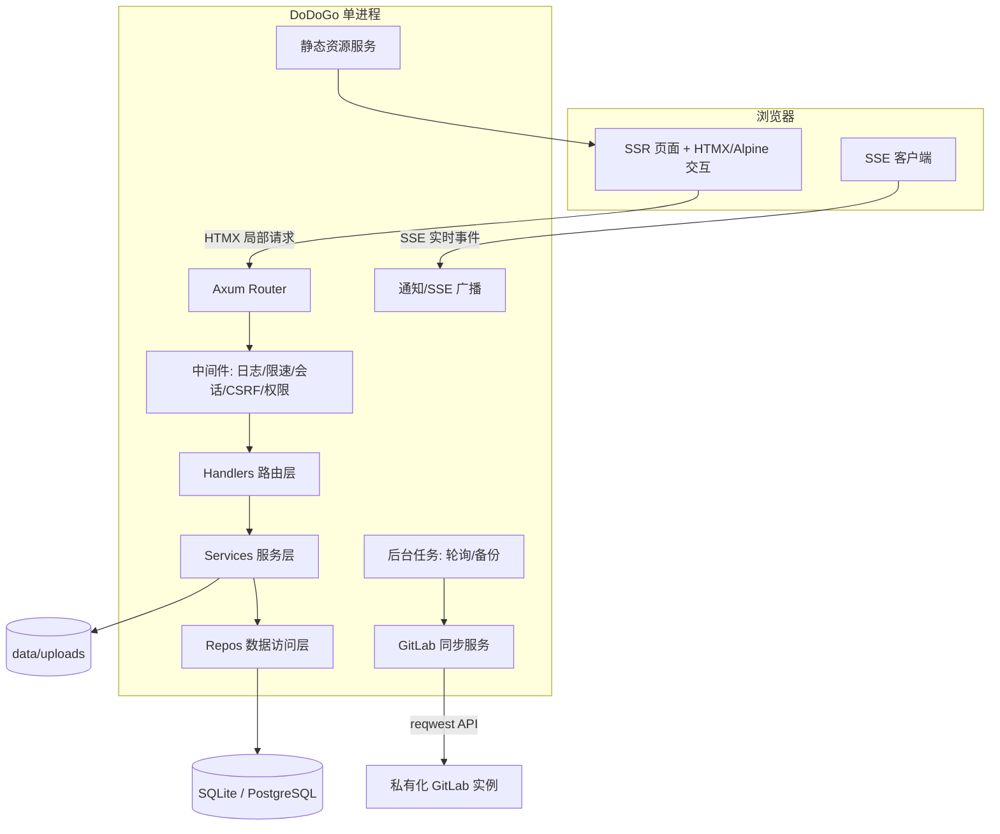

# DoDoGo 技术设计文档

| 项目名称 | DoDoGo |
| --- | --- |
| 文档版本 | v1.0 |
| 文档状态 | 评审稿 |
| 编写日期 | 2026-08-18 |
| 依赖文档 | 01-软件设计文档.md |

## 修订记录

| 版本 | 日期 | 修订人 | 说明 |
| --- | --- | --- | --- |
| v1.0 | 2026-08-18 | DoDoGo 团队 | 依据软件设计文档完成技术方案 |

---

# 1. 文档目的与范围

本文档描述 DoDoGo 的技术实现方案，包括：

1. 技术栈选型及其理由（高性能、低配置、易部署）；
2. 总体架构、进程模型与模块划分；
3. 后端、前端、数据库、GitLab 集成等核心模块的详细设计；
4. 性能、安全、部署、测试方案；
5. 依赖清单与版本策略。

设计原则与软件设计文档一致：**本地优先、轻量高效、简单直观、可扩展**。

---

# 2. 技术选型

## 2.1 选型原则

| 原则 | 要求 |
| --- | --- |
| 低资源占用 | 内存/CPU 占用低，空闲状态接近零开销 |
| 低部署门槛 | 单文件二进制、无需安装运行时、可离线分发 |
| 高性能 | 异步 IO、连接复用、缓存与索引到位 |
| 简单可维护 | 技术栈收敛、社区成熟、Rust 生态活跃 |
| 跨平台 | Windows 与 Linux 一致体验 |

## 2.2 后端选型对比

### 语言：Rust（需求指定，兼顾性能与安全）

- 零成本抽象、无 GC，内存占用与 CPU 开销远低于 Go/Java/Node；
- 编译为单一静态/动态链接二进制，部署零依赖；
- 内存安全保证，天然规避大量 Web 服务常见漏洞；
- 生态已成熟：Axum、Tokio、SQLx、Askama、Argon2 等。

### Web 框架：Axum（对比 Actix-web）

| 维度 | Axum | Actix-web |
| --- | --- | --- |
| 生态 | Tokio 官方维护，tower 中间件体系 | 独立运行时，性能极佳 |
| 学习曲线 | 与 Tokio/tower 一致，社区教程多 | 状态管理模型较特殊 |
| 可组合性 | 模块化 Router、类型安全提取器 | 强，但宏较多 |
| 结论 | **选用**：生态与可维护性更优 | 备选 |

### 异步运行时：Tokio

- Rust 事实标准异步运行时，支持多线程 work-stealing 调度；
- 配合 SQLx 的异步数据库访问与 reqwest 异步 HTTP 客户端。

### 数据库：SQLite（默认）+ PostgreSQL（可选）

| 维度 | SQLite（默认） | PostgreSQL（可选） |
| --- | --- | --- |
| 部署 | 零配置，单文件，随二进制分发 | 需独立安装，适合服务器多用户 |
| 性能 | WAL 模式单写多读，百万级卡片无压力 | 高并发写更强 |
| 运维 | 复制文件即备份 | 需要专业运维 |
| 结论 | **v1.0 默认** | 通过 SQLx 特性开关支持 |

### 数据访问：SQLx

- 异步、编译期可校验 SQL（`sqlx::query!`），同时支持 SQLite 与 PostgreSQL；
- 相比 Diesel/SeaORM：无需学习重量级 ORM 抽象，SQL 透明可控，性能接近手写；
- 自带迁移工具 `sqlx migrate`。

### 模板渲染：Askama

- 编译期模板（类 Jinja2 语法），默认 HTML 转义，天然防 XSS；
- 零运行时模板引擎开销，与 SSR 架构匹配。

### 密码哈希：Argon2id（`argon2` crate）

- OWASP 推荐算法；参数：`m=19456 KiB, t=2, p=1`，单次校验 ~0.05s；
- 相比 bcrypt/scrypt 在硬件加速可用时更抗 GPU 攻击。

### 会话：服务端 Session（自研轻量）

- 随机 256-bit 令牌，SHA-256 哈希后入库，支持吊销与多设备；
- 相比纯 JWT：可服务端失效、无法伪造、无需依赖第三方 crate；
- 通过 `axum-extra` 的 Cookie 提取或自研中间件实现。

### 缓存：moka（可选，性能优化期引入）

- 进程内高频缓存（用户、权限、项目元数据），TTL + LRU；
- 数据库已足够快时不引入，遵循 YAGNI；二期按需开启。

## 2.3 前端选型对比

### 方案 A：SSR + HTMX + Alpine.js（推荐）

| 维度 | 说明 |
| --- | --- |
| 架构 | 服务端渲染页面，HTMX 局部刷新，Alpine.js 处理轻量状态 |
| 体积 | 依赖合计 < 100KB（未压缩）；无 Node 构建链即可运行基础版 |
| 性能 | 首屏极快，交互数据量小 |
| 拖拽 | SortableJS（约 40KB）处理看板拖拽 |
| 适用 | 低配置设备、弱网、SSR 优先 |

### 方案 B：SPA（Vue 3 + Vite）

| 维度 | 说明 |
| --- | --- |
| 架构 | 前后端分离，REST + SSE |
| 体积 | 框架运行时 ~100KB+，首屏需加载 JS |
| 交互 | 富交互体验更好，利于二期复杂编辑器 |
| 适用 | 团队协作规模较大时 |

**结论：v1.0 采用方案 A（SSR + HTMX + Alpine.js + SortableJS + esbuild 打包）**。

理由：

- 与"低配置、高性能"目标完全匹配；
- 服务端渲染使 SEO/可分享链接友好；
- 卡片、看板等核心交互通过 HTMX 局部刷新 + SSE 实时同步即可满足；
- 避免引入大型前端框架带来的构建链与内存负担；
- 二期如需富文本所见即所得，可局部引入轻量编辑器或切换 SPA 化页面，架构不做推翻式变更。

## 2.4 最终技术栈总表

### 后端

| 类别 | 选型 |
| --- | --- |
| 语言 | Rust（stable，edition 2021） |
| Web 框架 | Axum 0.8 |
| 异步运行时 | Tokio（multi-thread） |
| 数据库访问 | SQLx（SQLite 默认 / PostgreSQL 可选） |
| 数据库 | SQLite（WAL）+ 迁移脚本 |
| 模板 | Askama |
| 密码哈希 | argon2（Argon2id） |
| HTTP 客户端 | reqwest（GitLab 调用） |
| 序列化 | serde / serde_json |
| 时间处理 | chrono / time |
| 日志 | tracing + tracing-subscriber + tracing-appender |
| 配置 | config crate + 环境变量 |
| 加密 | aes-gcm（Token 加密）+ rand（令牌生成） |
| 错误处理 | thiserror + anyhow |
| 校验 | validator crate（或手写轻量校验） |
| 文件 | tokio-util（流式上传） |

### 前端

| 类别 | 选型 |
| --- | --- |
| 交互 | 原生 TypeScript + fetch/SSE（v1.0 实际实现，零 CDN、零外部运行时依赖，未引入 HTMX/Alpine） |
| 拖拽 | 原生 HTML5 Drag & Drop（看板卡片 + 列排序） |
| Markdown 渲染 | 服务端 pulldown-cmark + ammonia（XSS 白名单）；预览走 `POST /api/markdown/preview` |
| Markdown WYSIWYG | contenteditable + `document.execCommand`（工具栏）+ 精简 HTML↔Markdown 转换（`html2md.ts`），存储仍为 Markdown |
| 构建 | esbuild（TS + CSS 打包）；产物随 `rust-embed` 内嵌进二进制（单文件可移植） |
| 语言 | TypeScript（strict） |
| 样式 | 手写 CSS 变量 + 少量组件类（不引框架） |
| 图标 | 内联 SVG 图标集（手绘/开源自绘，避免字体库） |
| 桌面客户端 | wry + tao（Windows WebView2），与网页版同源，自动拉起服务进程 |

### 工具链与工程

| 类别 | 选型 |
| --- | --- |
| 代码风格 | rustfmt + Clippy（`-D warnings`） |
| 测试 | cargo test（单元/集成）、Playwright（E2E） |
| CI | GitHub Actions（lint/test/build 三平台） |
| 打包 | cargo build --release；Windows MSI/zip、Linux tar.gz/systemd |
| 容器 | Docker（可选，alpine 运行镜像） |

---

# 3. 总体架构

## 3.1 架构图



## 3.2 运行时进程模型

- 单进程、多线程 Tokio runtime；
- 一个 Axum 服务同时承载：SSR 页面路由、REST API、SSE 长连接、静态资源；
- 后台任务（tokio::spawn）：GitLab 定时同步、自动备份、会话清理、通知到期扫描；
- 优雅停机：监听 SIGINT/SIGTERM，等待在途请求完成，关闭连接池后退出。

## 3.3 模块划分（分层）

```text
src/
├── main.rs            # 入口：配置加载、日志、数据库、路由装配
├── config.rs          # 配置结构与加载
├── state.rs           # AppState（连接池、上传目录、SSE 广播器）
├── error.rs           # 统一错误类型与响应转换
├── db.rs              # 连接池、迁移、初始化
├── routes.rs          # 路由注册
├── middlewares/       # 会话、CSRF、限速、权限
├── handlers/          # HTTP 层（薄）
│   ├── auth.rs  users.rs  projects.rs  boards.rs
│   ├── cards.rs  milestones.rs  releases.rs
│   ├── gitlab.rs  search.rs  notifications.rs  admin.rs
│   └── webhooks.rs  files.rs  health.rs
├── services/          # 业务层（权限校验、事务编排）
│   ├── auth.rs  permission.rs  project.rs  board.rs
│   ├── card.rs  activity.rs  notify.rs  search.rs
│   ├── storage.rs     # 文件存储
│   └── gitlab/        # client.rs  sync.rs  matcher.rs  encrypt.rs
├── repos/             # 数据访问层（SQLx）
│   ├── user.rs  project.rs  board.rs  card.rs ...
├── models/            # 领域结构体（serde 序列化）
├── templates/         # Askama 模板
├── webhooks/          # GitLab 签名校验
└── stream.rs          # SSE 连接管理与广播
```

## 3.4 目录结构（工程）

```text
dodogo/
├── Cargo.toml
├── config/
│   ├── config.toml            # 默认配置
│   └── config.example.toml    # 示例
├── migrations/                # SQLx 迁移
├── src/                       # 服务端
├── desktop/                   # 桌面客户端壳（wry + tao，Cargo workspace 成员）
├── web/
│   ├── ts/                    # 前端 TS 源码
│   ├── css/                   # 样式源码
│   └── static/                # 构建产物输出目录（发布时 rust-embed 内嵌）
├── templates/                 # Askama 模板（或置于 src/templates）
├── tests/                     # 集成测试
├── scripts/
│   ├── build.ps1 / build.sh
│   ├── install-windows.ps1
│   ├── install-linux.sh
│   └── release.ps1            # 打包（服务端 + 桌面客户端）
├── docker/
│   └── Dockerfile
└── docs/
```

---

# 4. 后端详细设计

## 4.1 配置管理

配置优先级：**环境变量 > 管理后台设置（存 DB）> config.toml > 内置默认值**。

```toml
# config.example.toml
server = { host = "127.0.0.1", port = 8080 }
data_dir = "./data"
database = { kind = "sqlite", url = "data/dodogo.db" }  # 或 postgres://...
security = { session_ttl_hours = 12, remember_ttl_days = 30, login_max_fail = 5, login_lock_minutes = 15 }
upload = { max_image_mb = 10, max_file_mb = 100 }
gitlab = { sync_interval_minutes = 5, default_regex = "(?i)(?:#|KEY-)(\\d+)" }
backup = { enabled = true, interval_days = 1, keep = 7 }
smtp = { enabled = false, host = "", port = 587, username = "", password = "" }
log = { level = "info", file = "data/logs/dodogo.log" }
master_key_file = "data/.master_key"   # 用于 GitLab Token 加密
```

- 环境变量使用 `DODOGO_` 前缀，如 `DODOGO_SERVER_PORT=9090`；
- 路径统一基于 `data_dir` 解析，禁止写入可执行文件目录；
- 首次启动自动创建数据目录并生成随机 master key。

## 4.2 数据库与迁移

### SQLite 初始化

- PRAGMA：`journal_mode=WAL`、`foreign_keys=ON`、`busy_timeout=5000`、`synchronous=NORMAL`；
- 连接池：`sqlx::SqlitePool`，`max_connections=5`（SQLite 单写多读，避免过多连接）；
- 迁移：`sqlx migrate`，schema 版本表 `_sqlx_migrations`；
- 数据库文件 + `-wal`/`-shm` 均位于 `data/`，备份时使用 `VACUUM INTO` 或在线备份 API。

### PostgreSQL（可选）

- 通过 `sqlx` feature `postgres` 编译切换；
- 表结构保持同一套迁移（SQLite/PostgreSQL 兼容 SQL 子集，差异处使用条件迁移）；
- 连接池 `max_connections=10`。

### 关键索引

| 表 | 索引 | 用途 |
| --- | --- | --- |
| cards | (project_id, no) | 单号唯一 |
| cards | (column_id, position) | 看板加载与拖拽重排 |
| cards | (assignee_id, status) | 我的任务 |
| cards | (milestone_id) / (version_id) | 里程碑/版本统计 |
| comments | (card_id, created_at) | 评论时间线 |
| activities | (card_id, created_at) | 活动时间线 |
| git_commits | (commit_sha) | 幂等去重 |
| notifications | (user_id, read, created_at) | 通知中心 |
| audit_logs | (created_at) | 审计查询 |

## 4.3 认证与会话

### 注册/登录流程

```mermaid
sequenceDiagram
    participant C as 浏览器
    participant S as DoDoGo
    participant DB as 数据库
    C->>S: POST /api/auth/login {username, password}
    S->>DB: 查询用户（含 status）
    alt 用户存在且 active
        S->>S: Argon2id 校验密码
        alt 校验通过
            S->>DB: 生成会话令牌（256bit），存 SHA-256 哈希
            S-->>C: Set-Cookie: session=...; HttpOnly; SameSite=Lax
        else 失败
            S->>DB: 记录失败次数，超限锁定
            S-->>C: 401 错误
        end
    else 不存在或禁用
        S-->>C: 401 错误（不区分提示，防枚举）
    end
```

- 会话令牌仅出现在 Cookie 中，数据库只存哈希；
- 每次请求由中间件查会话（moka 缓存会话 30s，减少 DB 查询）；
- 会话有效期：普通 12h / 记住我 30d，滑动续期；
- 吊销接口删除会话行并清除缓存；
- CSRF：Cookie 会话场景使用"双提交 Token"（页面注入随机 token，表单/请求头携带，服务端比对），API 场景用 Bearer Token 无需 CSRF。

## 4.4 权限系统

### 设计

```text
中间件(认证) → 校验会话 → 注入当前用户
路由提取(Path: project_key) → permission::require_project(ctx, role) → 放行或 403
业务层二次校验（数据级权限：本人卡片删除、评论编辑等）
```

- 系统级：`role=system_admin` 直接放行管理路由；
- 项目级：查询 `project_members`，角色映射到权限位图；
- 缓存：项目成员关系缓存（moka，TTL 60s），成员变更时主动失效；
- 所有项目接口统一先解析 `project_key` 并校验成员关系，防止水平越权；
- 权限枚举与矩阵在 `services/permission.rs` 中集中定义，避免散落魔法判断。

## 4.5 领域服务关键设计

### 4.5.1 看板全量加载

`GET /api/boards/{id}` 一次性返回：

```json
{
  "board": { "id": 1, "name": "开发看板" },
  "columns": [ { "id": 3, "name": "开发", "wipLimit": 0, "isDone": false } ],
  "cards": [ { "id": 10, "no": 12, "title": "...", "columnId": 3,
               "position": 1024, "priority": "p1", "assignee": {...},
               "labels": [...], "milestoneId": null, "versionId": null,
               "dueDate": null, "checklistDone": 2, "checklistTotal": 5 } ],
  "labels": [ ... ]
}
```

- 单次查询（联表 + 标签聚合），避免 N+1；
- 卡片列表只返回卡片概要字段，详情走 `GET /api/cards/{id}`；
- 大看板（>500 卡）v1.0 全量返回（1000 卡 ≈ 1-2MB JSON），二期引入按列懒加载/虚拟滚动。

### 4.5.2 拖拽移动

```text
POST /api/cards/{id}/move
{ "columnId": 5, "beforeCardId": null, "afterCardId": 42 }
```

服务端逻辑（事务）：

1. 校验卡片与目标列同属一个看板；
2. 计算新 position（取 before/after 均值；无间距时整列重排）；
3. 更新卡片列与 position；
4. 若移动至完成列且项目开启"自动完成"，标记完成；
5. 写 activities，触发通知（订阅者/指派人）；
6. 提交后广播 `card.moved` SSE。

乐观锁：请求携带 `updatedAt`，与库中不一致返回 409，前端提示"卡片已被他人更新"并刷新。

### 4.5.3 单号生成

```sql
UPDATE projects SET next_card_no = next_card_no + 1 WHERE id = ?
RETURNING next_card_no;
```

在创建卡片事务内执行，保证并发下不重复。

### 4.5.4 里程碑进度

- 统计查询：`COUNT(cards WHERE milestone_id=? AND column.is_done=true)` / 总数；
- 完成列变化、卡片移动时，相关里程碑/版本进度缓存失效；
- 前端进度条直接由接口返回的 `done/total/percent` 渲染。

## 4.6 GitLab 集成模块

> **支持范围（重要）：本项目 GitLab 集成的目标为私有化部署（自托管）的 GitLab**，即部署在本地网络或自有服务器上的 GitLab CE/EE 实例，基于 GitLab REST API v4 与 Webhook 标准协议实现。v1.0 不支持 GitLab.com 公有云，也不支持 GitHub.com；两者列入后续版本计划。

### 4.6.1 配置与加密

- `gitlab_configs.token_encrypted`：使用 AES-256-GCM，密钥来自 `data/.master_key`（或环境变量 `DODOGO_MASTER_KEY`）；
- API 请求前解密，内存中仅存在调用作用域内，不落日志；
- 测试连接：`GET {base}/api/v4/user` 校验令牌有效性与权限；
- `base_url` 校验：仅接受 http/https 私有化地址（本地或内网域名/IP）；检测到 `gitlab.com` / `github.com` 等公有云域名时拒绝保存，并提示"v1.0 仅支持私有化部署的 GitLab，公有云平台支持见后续版本"。

### 4.6.2 同步流程

```mermaid
flowchart TD
    A[触发: 定时器/手动/Webhook] --> B[读取项目 GitLab 配置]
    B --> C[调用 commits API 获取增量提交]
    C --> D{每条提交消息匹配单号?}
    D -- 是 --> E[幂等写入 git_commits]
    D -- 否 --> F[记录未匹配日志(可选)]
    E --> G[关联卡片, 更新 Git 区块]
    G --> H{含 Closes 且开启自动完成?}
    H -- 是 --> I[标记卡片完成]
    H -- 否 --> J[结束]
    I --> J
```

### 4.6.3 增量同步

- 记录每仓库 `last_sync_at` 与最后同步的 SHA；
- 提交 API 支持 `since` 参数按时间增量拉取；
- 提交量超过单页时按 `page` 分页拉取，单次同步上限 500 条；
- Webhook 事件（Push/MR）直接携带提交列表，无需回查，签名校验后增量入库；
- 幂等：`git_commits.commit_sha` 唯一索引，冲突时忽略（`ON CONFLICT DO NOTHING`）。

### 4.6.4 单号匹配器

- 默认正则：`(?i)(?:^|[^0-9A-Za-z-])(?:#|{KEY}-)(\d+)\b`（KEY 替换为项目 Key）；
- 支持自定义正则（配置项），编译后复用；
- 匹配测试工具：项目设置页提供"输入提交消息预览匹配结果"。

### 4.6.5 Webhook 校验

- 用户在 GitLab 配置中设置 Secret Token；
- DoDoGo 校验 `X-Gitlab-Token` 头与配置一致（恒定时间比较），失败返回 401；
- 回调路径携带 `projectId`（项目内部 ID），不暴露外部可猜测凭据。

## 4.7 文件存储

- 目录：`data/uploads/{YYYY}/{MM}/{sha256(file)}.{ext}`；
- 文件元数据入库（attachments），物理文件不可直接路径访问；
- 下载接口校验权限后流式返回（`tokio_util::io::ReaderStream`）；
- 上传：先写临时文件（`data/tmp`），校验大小/类型成功后原子改名至目标路径；
- 图片处理：一期仅校验格式与大小，不重压缩（减少依赖）；二期可引入 `image` crate 生成缩略图；
- 清理：孤儿临时文件（>24h）由后台任务定期删除。

## 4.8 搜索方案

### v1.0：SQL 索引 + LIKE

- 标题/描述/评论全文 LIKE 查询（前缀匹配走索引，中间匹配全表）；
- 单号精确匹配（`project_id + no`）优先；
- 看板内筛选全部走索引（column_id、assignee_id、label、milestone 等组合索引）；
- 数据规模（<10 万卡片）下响应 < 100ms，满足需求。

### 二期：tantivy 全文索引（可选）

- Rust 原生全文检索引擎，支持中文分词插件；
- 后台异步索引，写入时更新；搜索接口切换后端，前端无感知；
- 触发条件：单项目卡片 > 5 万或搜索 P95 > 500ms。

## 4.9 实时推送（SSE）

- 端点：`GET /api/stream?channel=board:{boardId}`，需登录；
- 连接管理：`tokio::sync::broadcast` 按 board/project 分频道，服务端持有 Sender 集合；
- 心跳：每 25s 发送 `: ping` 注释行，防代理断连；
- 重连：前端 `EventSource` 自动重连，携带 `Last-Event-ID`（可选），服务端补发（v1.0 简化为重连后全量刷新看板）；
- 广播范围：`card.created/updated/moved/deleted`、`comment.added`、`board.changed` 等（见软件设计文档 §7.3）；
- 连接数上限：单进程默认 1024，可配置；超限拒绝并提示刷新。

## 4.10 后台任务

| 任务 | 周期 | 实现 |
| --- | --- | --- |
| GitLab 定时同步 | 项目配置的间隔（默认 5min） | `tokio::time::interval` + 项目扫描 |
| 自动备份 | 每日，可配置 | 生成 zip 到 `data/backups`，保留 N 份 |
| 会话清理 | 每小时 | 删除过期会话 |
| 回收站清理 | 每天 | 删除超过 30 天的 deleted 数据 |
| 临时文件清理 | 每天 | 删除 >24h 的 tmp 文件 |
| 通知到期扫描 | 每小时 | 生成截止日期提醒通知 |

## 4.11 日志与审计

- `tracing` 结构化日志：`时间 | 级别 | span(请求id, 用户id, 项目key) | 事件`;
- 输出：stdout（开发）+ 滚动文件（生产，`tracing-appender`，按大小/日期滚动）；
- 日志脱敏：密码、Token、Cookie 永不记录；
- 审计日志独立表（audit_logs），记录：登录成功/失败、登出、用户管理、密码重置、项目删除/恢复、备份/恢复、系统设置变更；
- 请求日志中间件记录：方法、路径、状态码、耗时（不含 body）。

## 4.12 错误处理

- 统一 `AppError`（thiserror 定义），映射到 HTTP 状态码与错误码（软件设计文档 §7.4）；
- 分层转换：repos → services → handlers，逐层包裹上下文（`context` / `with_context`）；
- 未捕获错误统一 500 + 错误 ID（`request_id`），日志含完整堆栈；
- 校验失败返回 400 + 字段级错误列表。

---

# 5. 前端详细设计

## 5.1 渲染与路由

- Askama 模板服务端渲染页面骨架（导航、看板初始数据、CSRF token）；
- 页面级路由：`/`、`/login`、`/p/{key}/...`、`/admin/...`、`/search`、`/notifications`；
- 交互局部刷新：HTMX 属性驱动（`hx-get/hx-post/hx-target/hx-swap`），服务端返回 HTML 片段；
- 需要 JSON 的场景（拖拽落库、卡片详情数据）走 fetch API + Alpine。

## 5.2 看板拖拽实现

```text
SortableJS 绑定每个列容器（group: boardId）
  onAdd / onUpdate → 计算 before/after 卡片 id → POST /api/cards/{id}/move
  乐观更新：先改 DOM，失败回滚 + Toast
  WIP 检查：目标列卡片数 >= wipLimit 且项目配置为阻止 → 拒绝放置
列排序：SortableJS 绑定列容器 → POST /api/columns/{id}/move
```

- 拖拽期间禁用全局快捷键，防误操作；
- SSE 收到 `card.moved` 时：若本地无操作中，刷新受影响卡片位置（按 position 重排 DOM）。

## 5.3 Markdown 编辑器

- v1.0 形态：textarea（编辑）+ 预览区（并排/切换）；
- 预览：服务端渲染（pulldown-cmark + ammonia 白名单），HTMX 提交预览；或前端 marked + DOMPurify 即时预览（推荐，减少请求）；
- 图片粘贴：`paste` 事件捕获 → 上传接口 → 插入 ``；
- 卡片引用：输入 `[[` 触发项目卡片搜索提示，插入 `[[DODG-12]]`；
- 工具栏通过 Alpine 状态驱动 `document.execCommand` 兼容层或直接文本插入；
- 二期 WYSIWYG：可评估 TipTap（ProseMirror）局部引入，不影响现有数据格式（Markdown 存储不变）。

## 5.4 构建与静态资源

- esbuild 打包 `web/ts` → `web/static/assets/app-{hash}.js`，CSS 同理；
- 资源文件名带内容哈希，服务端下发 `Cache-Control: public, max-age=31536000, immutable`；
- HTML 通过 `?v=` 或模板变量引用当前构建清单；
- 压缩：Nginx `gzip/brotli` 或服务端静态中间件；
- 前端 TS 严格模式，禁 `any`（除第三方边界）。

## 5.5 状态同步

- Alpine 维护页面级轻状态（当前筛选、拖拽态、弹窗态）；
- 数据权威在服务端，SSE 事件驱动局部刷新；
- 提交失败统一走"错误 Toast + 恢复原状"；
- 表单提交使用 HTMX `hx-disabled-elt` 防止重复提交，成功/失败由响应片段替换并提示。

## 5.6 样式与主题

- CSS 变量定义全部设计令牌（软件设计文档 §5.1）；
- `[data-theme="dark"]` 切换变量集合，组件无需重复适配；
- 组件类命名：`btn btn-primary`、`card`、`tag tag-red`、`input` 等，控制在 40 个以内，避免过度抽象；
- 无第三方 UI 框架依赖。

---

# 6. 性能设计

## 6.1 目标指标（复述与量化）

| 指标 | 目标 | 验证方式 |
| --- | --- | --- |
| 看板页首屏 | 本地 ≤ 500ms | 手工 + Lighthouse |
| API P95（常规读写） | ≤ 100ms | wrk / autocannon 压测 |
| 1000 卡看板加载 | ≤ 800ms | 接口耗时 + 页面可交互时间 |
| 100 并发只读 | 无超时、错误率 < 0.1% | wrk 混合场景 |
| 20 并发写 | 事务冲突率 < 5% | 拖拽并发模拟 |
| 空闲内存 | ≤ 80MB | 任务管理器 / `ps` |

## 6.2 数据库优化

- WAL + `synchronous=NORMAL` + busy_timeout；
- 写事务短小（单卡移动一个事务），避免长事务阻塞；
- 连接池上限 5（SQLite），多余并发写排队而非打崩；
- 只查所需列（`SELECT id, title, position ...`），避免 `SELECT *`；
- 分页使用 keyset（`WHERE position > ? ORDER BY position LIMIT ?`）替代 OFFSET 深分页；
- 统计类查询（里程碑进度）缓存 30s。

## 6.3 缓存策略

| 缓存对象 | 容器 | TTL | 失效时机 |
| --- | --- | --- | --- |
| 会话 | moka | 30s | 登录/登出/吊销主动失效 |
| 项目成员关系 | moka | 60s | 成员变更主动失效 |
| 系统设置 | moka | 60s | 后台修改主动失效 |
| 里程碑/版本统计 | moka | 30s | 相关卡片变更主动失效 |
| 静态资源 | HTTP 缓存 | 1 年（hash 命名） | 版本发布 |

> v1.0 开发期可先不引入 moka（DB 已足够快），在性能阶段按压测结果接入，避免过度设计。

## 6.4 网络与静态资源

- 全部静态资源本地托管，无 CDN 依赖；
- HTML 响应启用 `Cache-Control: no-cache`，保证数据新鲜；
- 看板全量数据 JSON 使用 `Content-Encoding: gzip`（中间件）；
- SSE 仅推送变更事件，不推送全量数据。

## 6.5 大列表策略

- 看板：1000 卡全量渲染 + 列内 DOM 复用（一期）；二期引入虚拟滚动；
- 通知/审计/搜索结果：keyset 分页，每页 20-50 条；
- 里程碑/版本列表：分页 + 统计聚合单条 SQL。

## 6.6 压测方案

工具：wrk（HTTP）、自定义 Rust 脚本（写场景）、Playwright（浏览器端）。

场景：

1. 登录 + 看板加载（100 并发）；
2. 卡片创建/更新（20 并发写）；
3. 跨列拖拽（模拟并发移动同一列卡片）；
4. 搜索（混合关键字）；
5. 长时间运行（12h 稳定性，内存曲线）。

通过标准：错误率 < 0.1%，P95 达标，内存无泄漏趋势（Rust 无 GC，需确认无句柄泄漏）。

---

# 7. 安全设计

## 7.1 认证安全

- Argon2id 参数 `m=19456, t=2, p=1`；注册后强制走标准登录流程；
- 会话令牌 256-bit 随机，仅存哈希；Cookie `HttpOnly; SameSite=Lax`，HTTPS 下 `Secure`；
- 登录限速：按账号 + IP 双层（moka 计数）；锁定 15 分钟；
- 密码强度校验（长度 ≥ 8，含字母数字）；管理员重置密码后强制首次登录修改（可配置）。

## 7.2 Web 安全

| 攻击面 | 防护 |
| --- | --- |
| XSS | Askama 默认转义；Markdown 渲染 ammonia 白名单（去 script/iframe/事件属性）；上传文件不走内联执行；CSP：`default-src 'self'`，内联脚本仅允许非关键（Alpine 需 `'unsafe-inline'` 的缩小方案：外置脚本 + CSP nonce） |
| CSRF | 双提交 Token + SameSite Cookie；写操作校验 |
| SQL 注入 | SQLx 参数化 + 编译期校验 |
| 路径穿越 | 上传文件名服务端重写（内容哈希），下载按 ID 查库 |
| 越权 | 项目/资源级权限中间件 + 业务层二次校验；ID 不可枚举猜测的防御性 404 |
| 点击劫持 | `X-Frame-Options: DENY` |
| 信息泄露 | 错误响应不返回堆栈；登录失败统一提示；HTTP 头禁用 `Server` 版本 |
| 慢速攻击 | 请求体大小限制、超时中间件（body ≤ 10MB，总超时 60s） |
| 暴力破解 | 登录限速 + 审计告警（可选） |

## 7.3 数据安全

- 数据库文件默认权限 600（Windows 继承 ACL）；数据目录提示不要放置于 Web 根目录；
- GitLab Token AES-GCM 加密存储，主密钥独立文件 + 环境变量覆盖；
- 备份 zip 可设置密码（二期）；
- 删除数据：回收站 30 天后物理删除；上传文件随卡片删除同步删除（引用计数）。

## 7.4 依赖安全

- 依赖锁定（Cargo.lock）；`cargo audit` 每周 CI 检查漏洞；
- 升级策略：补丁版本自动跟进，次版本人工评估；
- 前端依赖同理由 `npm audit`（构建机）检查。

---

# 8. 部署设计

## 8.1 单机模式（默认）

### Windows

1. 解压发布包（`dodogo.exe` + `config.example.toml` + 启动脚本）；
2. 运行 `install-windows.ps1`：创建数据目录、注册 NSSM 服务、开机自启；
3. 访问 `http://127.0.0.1:8080`，完成初始化向导；
4. 升级：停止服务 → 替换 exe → 启动服务（数据库自动迁移）。

### Linux

1. 解压 `dodogo-linux-x64.tar.gz` 至 `/opt/dodogo`；
2. `./install-linux.sh`：创建 `dodogo` 用户、systemd unit、开机自启；
3. 访问 `http://127.0.0.1:8080`。

systemd 单元要点：

```ini
[Unit]
Description=DoDoGo Project Management
After=network.target

[Service]
User=dodogo
WorkingDirectory=/opt/dodogo
ExecStart=/opt/dodogo/dodogo --config /opt/dodogo/config.toml
Restart=on-failure
RestartSec=3
LimitNOFILE=65536

[Install]
WantedBy=multi-user.target
```

## 8.2 Docker（可选）

```dockerfile
FROM rust:1.80 AS builder
WORKDIR /app
COPY . .
RUN cargo build --release

FROM alpine:3.20
RUN apk add --no-cache ca-certificates tzdata
COPY --from=builder /app/target/release/dodogo /usr/local/bin/dodogo
WORKDIR /data
EXPOSE 8080
ENTRYPOINT ["dodogo", "--config", "/data/config.toml"]
```

- 挂载 `/data` 持久化；
- 使用 `-p 127.0.0.1:8080:8080` 仅本机映射（默认），公网场景配反向代理。

## 8.3 反向代理与 HTTPS

```nginx
server {
    listen 443 ssl;
    server_name dodogo.example.com;
    client_max_body_size 110m;

    location / {
        proxy_pass http://127.0.0.1:8080;
        proxy_http_version 1.1;
        proxy_set_header Host $host;
        proxy_set_header X-Forwarded-For $proxy_add_x_forwarded_for;
        proxy_set_header X-Forwarded-Proto $scheme;
        proxy_buffering off;          # SSE 需要
        proxy_read_timeout 3600s;
    }
    gzip on;
    gzip_types application/json text/html text/css application/javascript image/svg+xml;
}
```

## 8.4 备份与恢复

- 在线备份：`dodogo backup` → 使用 SQLite 在线备份 API（或 `VACUUM INTO`）生成一致快照 + 打包 uploads；
- 后台定时备份：每日生成 zip 至 `data/backups`，保留最近 7 份；
- 恢复：停止服务 → `dodogo restore <backup.zip>` → 启动；
- 异地备份建议：用户自行将 `data/backups` 同步到 NAS/网盘（文档中给出指引）。

## 8.5 升级策略

- 版本号语义化（`MAJOR.MINOR.PATCH`）；
- 数据库 schema 版本在迁移表中维护，启动时自动执行未应用的迁移；
- 破坏性变更：大版本升级文档提供备份→升级→回滚指引；
- 回滚：保留上一版本二进制，数据库迁移向下兼容策略在 v1.0 期保持"只增不删"。

---

# 9. 测试设计

## 9.1 测试分层

| 层级 | 工具 | 覆盖内容 | 目标 |
| --- | --- | --- | --- |
| 单元测试 | cargo test | 单号生成、排序、匹配器、权限矩阵、加密 | 核心逻辑 100% |
| 集成测试 | cargo test + 临时 SQLite | API 全流程、事务、并发 | 主要 API ≥ 90% |
| E2E | Playwright | 登录、创建项目、建板、拖拽、卡片编辑、GitLab 展示 | 核心用户旅程 |
| 性能测试 | wrk / 自研脚本 | 接口 P95、并发、内存 | 达标指标 |
| 安全测试 | cargo audit + 手工 | 依赖漏洞、XSS/CSRF 复核、越权用例 | 无高危 |

## 9.2 测试要点

- 数据库：集成测试使用 `:memory:` 或临时文件 SQLite，迁移脚本在 CI 中完整执行；
- 拖拽：E2E 模拟 SortableJS 拖放，断言 position 与列变化；
- GitLab：mock HTTP server（`wiremock` 或自写）模拟 commits/Webhook 响应；
- 并发：模拟 20 并发创建卡片，断言单号不重复；
- 权限：针对权限矩阵逐项自动化用例（每个角色 × 每个操作）。

---

# 10. 附录

## 10.1 核心依赖清单（Cargo.toml 规划）

```toml
[dependencies]
axum = "0.8"
tokio = { version = "1", features = ["full"] }
sqlx = { version = "0.8", features = ["runtime-tokio", "sqlite", "migrate", "chrono"] }
askama = "0.13"
serde = { version = "1", features = ["derive"] }
serde_json = "1"
chrono = { version = "0.4", features = ["serde"] }
argon2 = "0.5"
rand = "0.8"
sha2 = "0.10"
aes-gcm = "0.10"
reqwest = { version = "0.12", features = ["json", "rustls-tls"] }
thiserror = "1"
anyhow = "1"
validator = "0.18"
tracing = "0.1"
tracing-subscriber = { version = "0.3", features = ["env-filter", "json"] }
tracing-appender = "0.2"
config = "0.14"
moka = { version = "0.12", optional = true }
tokio-util = { version = "0.7", features = ["io"] }
ammonia = "4"
pulldown-cmark = "0.12"
uuid = { version = "1", features = ["v4"] }
```

## 10.2 版本策略

- Rust：stable，锁定工具链版本于 CI 中（`rust-toolchain.toml`）；
- 依赖：Cargo.lock 提交入库，保证可复现构建；
- 前端构建：esbuild 版本固定于 package.json lockfile。

## 10.3 关键技术决策记录（ADR 摘要）

| 决策 | 结论 | 原因 |
| --- | --- | --- |
| SSR+HTMX 而非 SPA | SSR+HTMX | 低配置、低资源、首屏快；二期可渐进式增强 |
| SQLite 默认、PG 可选 | 双支持 | 单机零配置；服务器模式可扩展 |
| 服务端 Session 而非 JWT | Session | 可吊销、可管理、实现简单 |
| SQLx 而非 ORM | SQLx | 编译期 SQL 校验、性能透明、双数据库 |
| SSE 而非 WebSocket | SSE | 单向推送场景足够、实现简单、代理友好；双向实时交互二期评估 |
| GitLab Token 加密存储 | AES-GCM | 防明文泄露；主密钥独立管理 |
| 联动平台范围 | 仅私有化部署的 GitLab；GitLab.com / GitHub.com 列入后续版本计划 | 私有化部署场景的核心诉求；公有云 API 与认证差异留待后续适配 |
